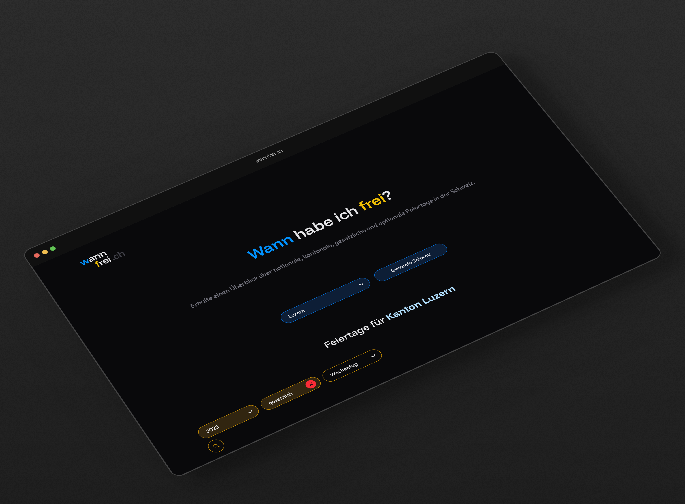

<p align="center">
    <div align="center">
        
    </div>
    <h1 align="center"><a href="https://wannfrei.ch" alt="wannfrei.ch" >wannfrei.ch</a></h1>
    <p align="center">
        Get an overview of national, cantonal, statutory and optional public holidays in Switzerland.
    </p>
</p>

</br>

Visit: [wannfrei.ch](https://wannfrei.ch)

</br>



<br>

## Tech Stack
- NextJS
- TypeScript
- TailwindCSS

<br>

## Getting Started

### Prerequisites

- Node.js
- npm

### Installation

```bash
git clone https://github.com/codeofandrin/wannfrei.git
cd wannfrei
npm install
```

### Development

```bash
npm run dev
```

Open [http://localhost:3000](http://localhost:3000) to view the site.

### Build for Production

```bash
npm run build
npm start
```

## Project Structure

- `src/app` - Next.js app directory (routing, pages, layouts)
- `src/assets` - Fonts and icons
- `src/components` - Components of the app
- `src/content` - Markdown content for certain pages
- `src/hooks` - Custom react hooks
- `src/utils` - Utility functions and constants

## Copyright

Copyright (c) codeofandrin

This source code is licensed under the MIT license found in the
[LICENSE](LICENSE) file in the root directory of this source tree.
